# Test Effort Estimation Tool — Design Document

**Version:** 3.3.0
**Date:** 2026-03-17

---

## Table of Contents

- [1. Architecture Overview](#1-architecture-overview)
- [2. Component Diagram](#2-component-diagram)
- [3. Data Flow](#3-data-flow)
- [4. Estimation Workflow](#4-estimation-workflow)
- [5. Authentication Flow](#5-authentication-flow)
- [6. Calculation Engine](#6-calculation-engine)
- [7. Database Schema](#7-database-schema)
- [8. API Layer](#8-api-layer)
- [9. Frontend Architecture](#9-frontend-architecture)
- [10. Integration Architecture](#10-integration-architecture)
- [11. Report Generation](#11-report-generation)
- [12. Deployment Architecture](#12-deployment-architecture)

---

## 1. Architecture Overview

The application follows a **three-tier architecture** with strict separation between presentation, business logic, and data access layers.

```
┌─────────────────────────────────────────────────────────────┐
│                      Presentation Tier                       │
│  ┌──────────────┐  ┌──────────────┐  ┌───────────────────┐  │
│  │   NiceGUI    │  │  Streamlit   │  │  C# WinForms      │  │
│  │  (Port 8502) │  │ (Port 8501)  │  │  (Desktop)        │  │
│  └──────┬───────┘  └──────┬───────┘  └────────┬──────────┘  │
│         │                 │                    │             │
│         └────────────┬────┘                    │             │
│                      │ HTTP/REST               │ JSON IPC    │
├──────────────────────┼─────────────────────────┼─────────────┤
│                      ▼                         ▼             │
│                  Business Logic Tier                          │
│  ┌───────────────────────────────────────────────────────┐   │
│  │                FastAPI Application                     │   │
│  │  ┌──────────┐  ┌───────────┐  ┌───────────────────┐  │   │
│  │  │  Routes   │  │   Auth    │  │   Integrations    │  │   │
│  │  │ (60+ EP)  │  │  (RBAC)  │  │ (5 adapters)      │  │   │
│  │  └─────┬────┘  └─────┬────┘  └───────┬───────────┘  │   │
│  │        │              │               │               │   │
│  │  ┌─────▼──────────────▼───────────────▼───────────┐  │   │
│  │  │              Engine (Pure Logic)                │  │   │
│  │  │  calculator │ feasibility │ calibration │ alloc │  │   │
│  │  └────────────────────────────────────────────────┘  │   │
│  └───────────────────────┬───────────────────────────────┘   │
├──────────────────────────┼───────────────────────────────────┤
│                          ▼                                    │
│                    Data Access Tier                           │
│  ┌───────────────────────────────────────────────────────┐   │
│  │   SQLAlchemy 2.0 ORM  →  SQLite / MySQL               │   │
│  │   15 tables │ auto-migration │ seed data               │   │
│  └───────────────────────────────────────────────────────┘   │
└─────────────────────────────────────────────────────────────┘
```

**Key design decisions:**
- The **estimation engine** (`engine/`) is kept pure — no database imports, only dataclasses and math. This enables unit testing without DB fixtures.
- All API routes live in a **single `routes.py`** file for discoverability (60+ endpoints).
- Configuration is **database-driven** (not env vars) for runtime flexibility.
- Authentication supports **three providers** (local, LDAP, OIDC) with a unified JWT session model.

---

## 2. Component Diagram

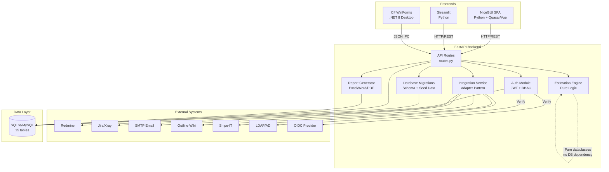

---

## 3. Data Flow

### 3.1 Estimation Creation Flow

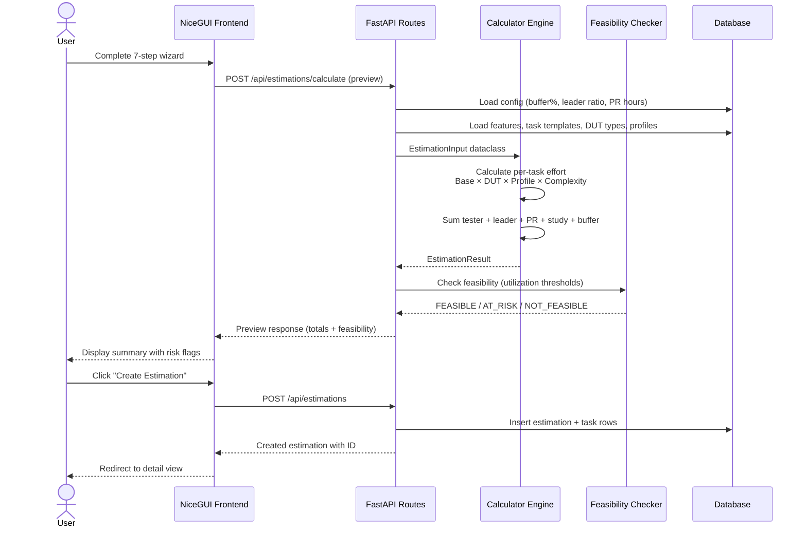

### 3.2 Request-to-Estimation Flow

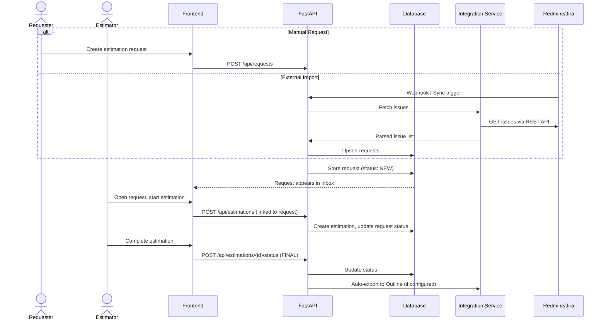

---

## 4. Estimation Workflow

### 7-Step Wizard State Machine

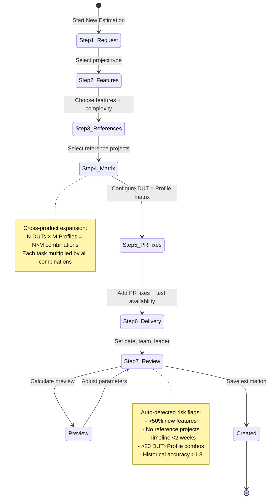

### Estimation Status Lifecycle

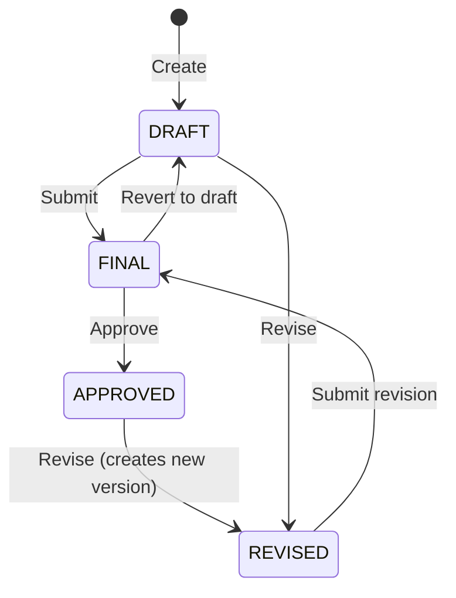

---

## 5. Authentication Flow

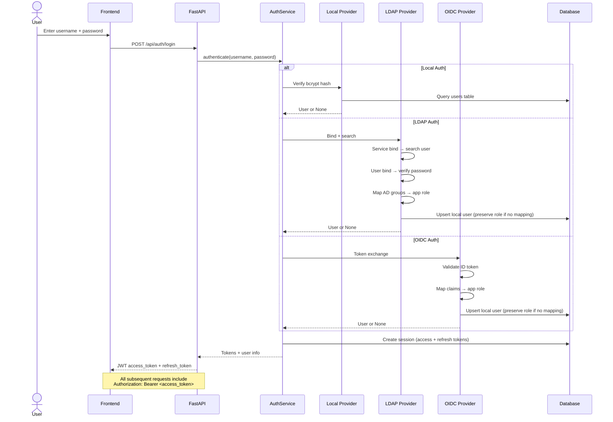

### RBAC Permission Model

```
┌──────────┬────────┬───────────┬──────────┬───────┐
│ Resource │ VIEWER │ ESTIMATOR │ APPROVER │ ADMIN │
├──────────┼────────┼───────────┼──────────┼───────┤
│ View     │   ✓    │     ✓     │    ✓     │   ✓   │
│ Create   │   ✗    │     ✓     │    ✓     │   ✓   │
│ Edit     │   ✗    │     ✓     │    ✓     │   ✓   │
│ Approve  │   ✗    │     ✗     │    ✓     │   ✓   │
│ Delete   │   ✗    │     ✗     │    ✗     │   ✓   │
│ Users    │   ✗    │     ✗     │    ✗     │   ✓   │
│ Settings │   ✗    │     ✗     │    ✗     │   ✓   │
│ Audit    │   ✗    │     ✗     │    ✗     │   ✓   │
└──────────┴────────┴───────────┴──────────┴───────┘
```

---

## 6. Calculation Engine

### Core Formula

```
Task_Effort = Base_Hours × DUT_Multiplier × Profile_Multiplier × Complexity_Weight

Tester_Total = Σ(Task_Effort for all tasks × all DUT×Profile combinations)
Leader_Total = Tester_Total × leader_effort_ratio (default 0.5)
PR_Fix_Hours = Σ(count × hours_per_complexity) for Simple/Medium/Complex
PR_NoTest_Hours = count_without_tests × pr_no_test_hours
Study_Hours = count_new_features × new_feature_study_hours
Doc_Hours = Σ(doc_type.base_hours × count) - overlap_deductions
Buffer = (Tester + Leader + PR + Study + Doc) × buffer_percentage

Grand_Total = Tester + Leader + PR + PR_NoTest + Study + Doc + Buffer
```

### Calculation Pipeline

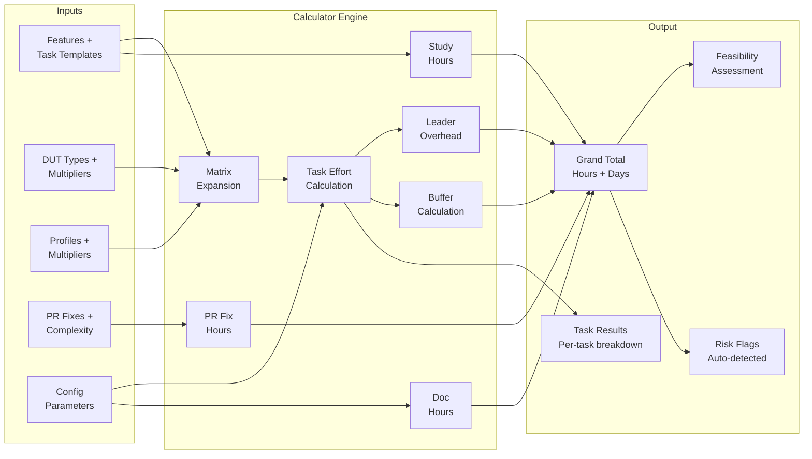

### Feasibility Assessment

```
Available_Capacity = delivery_days × team_size × working_hours_per_day
Utilization = Grand_Total / Available_Capacity × 100%

┌─────────────────┬────────────────┬────────────────────────────┐
│ Utilization      │ Status         │ Action                     │
├─────────────────┼────────────────┼────────────────────────────┤
│ ≤ 80%           │ FEASIBLE       │ Proceed as planned         │
│ 80% – 100%      │ AT_RISK        │ Consider mitigation        │
│ > 100%          │ NOT_FEASIBLE   │ Extend date or add staff   │
└─────────────────┴────────────────┴────────────────────────────┘
```

---

## 7. Database Schema

### Entity Relationship Diagram

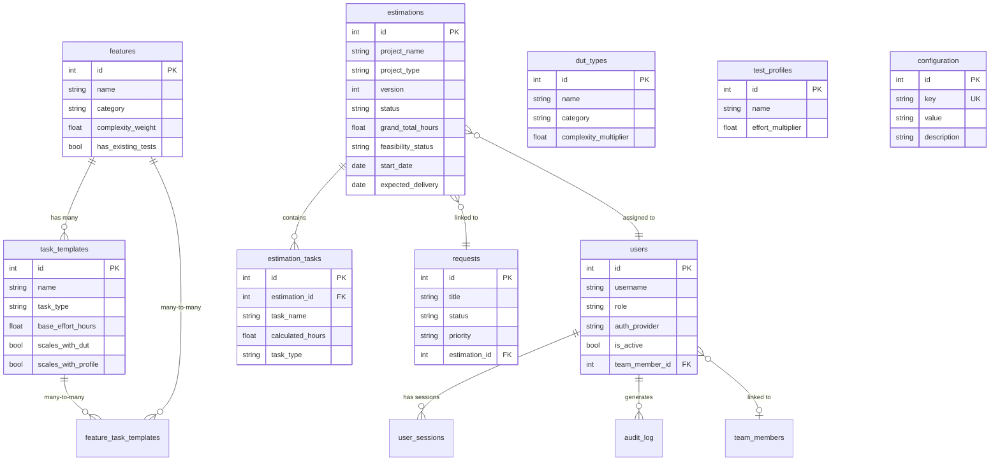

### Migration Strategy

The application uses a **version-based migration** system:
1. Schema version tracked in `configuration` table (`schema_version` key)
2. `init_database()` runs on FastAPI startup via lifespan handler
3. Migrations are applied sequentially (v1 → v2 → ... → v14)
4. `_ensure_config_keys()` guarantees config entries exist even on fresh installs
5. Seed data loaded from `database/seed_data.json` on first init

---

## 8. API Layer

### Request Processing Pipeline

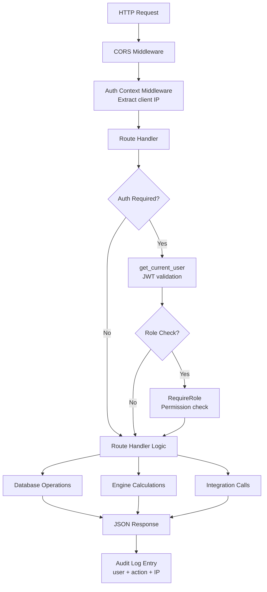

### Endpoint Organization

All 60+ endpoints are in a single `routes.py` organized by resource:

```
/api/auth/*              Authentication (login, refresh, logout, me, ldap/sync)
/api/features/*          Feature catalog CRUD
/api/task-templates/*    Task template CRUD
/api/dut-types/*         DUT registry CRUD + categories
/api/profiles/*          Test profile CRUD
/api/historical-projects/* Historical project management
/api/team-members/*      Team roster CRUD
/api/estimations/*       Estimation CRUD + calculate + revise + reports
/api/requests/*          Request inbox CRUD
/api/configuration/*     Key-value settings
/api/integrations/*      External system config + test + sync
/api/users/*             User management (ADMIN)
/api/audit-log           Audit log viewer (ADMIN)
/api/dashboard/stats     Dashboard statistics
/api/public-holidays/*   Holiday calendar CRUD
/api/working-weeks       Working weeks calculator
/api/webhooks/redmine    Redmine webhook receiver
```

---

## 9. Frontend Architecture

### NiceGUI SPA Architecture

```mermaid
graph TB
    subgraph Browser["Browser (Quasar/Vue)"]
        WS[WebSocket Connection]
        QC[Quasar Components]
        EC[ECharts Widgets]
    end

    subgraph NiceGUI["NiceGUI Server (Python)"]
        APP[app.py<br/>Entry + Dashboard + Auth]
        subgraph Pages
            P1[estimation.py]
            P2[features.py]
            P3[duts.py]
            P4[users.py]
            P5[settings.py]
            P6[... 12 more pages]
        end

        SB[Sidebar Navigation]
        AH[Auth Helpers<br/>api_get/post/put/delete]
        ERR[Error Pages<br/>400/401/403/422/504]
    end

    subgraph Backend["FastAPI Backend"]
        API[REST API<br/>Port 8000]
    end

    WS <-->|Real-time updates| APP
    APP --> Pages
    APP --> SB
    APP --> AH
    APP --> ERR
    AH -->|HTTP + Bearer token<br/>+ X-Forwarded-For| API

    style Browser fill:#1a1a2e
    style NiceGUI fill:#16213e
    style Backend fill:#0f3460
```

### Page Structure Pattern

Each NiceGUI page follows a consistent pattern:

```python
@ui.page("/page-name")
async def page_name() -> None:
    # 1. Auth guard
    if not is_authenticated():
        ui.navigate.to("/login")
        return

    # 2. Sidebar
    sidebar()

    # 3. Load data
    data = await api_get("/endpoint")

    # 4. Table with columns, slots, and pagination
    table = ui.table(columns=..., rows=data, pagination={"rowsPerPage": 15})

    # 5. Custom slots for badges, actions
    table.add_slot("body-cell-status", "<q-badge .../>")
    table.add_slot("body-cell-actions", "<q-btn @click='() => $parent.$emit(...)' />")

    # 6. Event handlers → dialog CRUD
    table.on("edit", lambda e: open_edit_dialog(e.args))
```

---

## 10. Integration Architecture

### Adapter Pattern

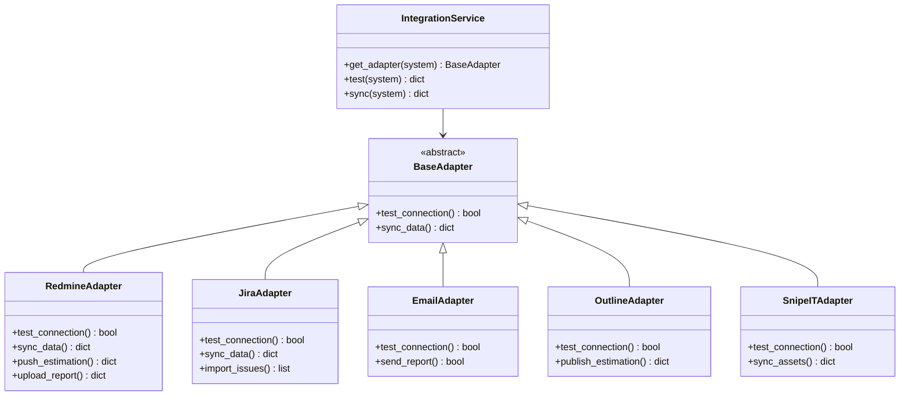

### Integration Data Flow

```
┌──────────────────┐     ┌──────────────────┐     ┌────────────────┐
│  External System  │────▶│ Integration      │────▶│   Database     │
│  (Redmine/Jira)  │     │ Adapter          │     │  (requests)    │
└──────────────────┘     └──────────────────┘     └────────────────┘
        ▲                         │
        │                         │ Sync results
        │                         ▼
        │                 ┌──────────────────┐
        └─────────────────│ Push estimation  │
          Export results  │ results back     │
                          └──────────────────┘
```

---

## 11. Report Generation

### Report Pipeline

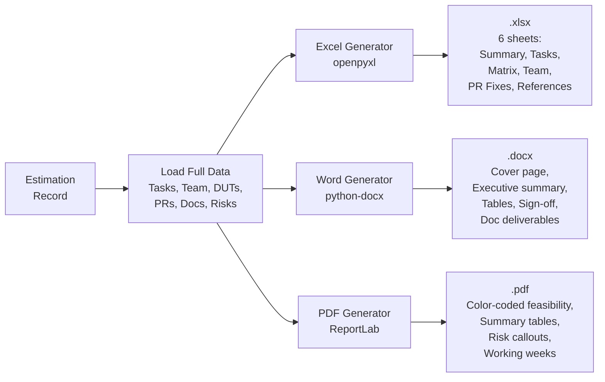

### Report Contents

| Section | Excel | Word | PDF |
|---------|-------|------|-----|
| Project Summary | Sheet 1 | Page 1-2 | Page 1 |
| Task Breakdown | Sheet 2 | Table | Table |
| DUT × Profile Matrix | Sheet 3 | Table | Table |
| Team Allocation | Sheet 4 | Table | Table |
| PR Fixes (with test_available) | Sheet 5 | Table | Table |
| Document Deliverables | In Summary | Section | Section |
| Feasibility Assessment | In Summary | Callout | Color-coded |
| Risk Flags | In Summary | Bullet list | Callout box |
| Working Weeks | In Summary | Footer | Footer |
| References | Sheet 6 | Table | Table |

---

## 12. Deployment Architecture

### Docker Deployment

```mermaid
graph TB
    subgraph Docker["Docker Container"]
        subgraph Services
            UV[Uvicorn<br/>FastAPI Backend<br/>Port 8000]
            NG[NiceGUI Frontend<br/>Port 8502]
        end

        subgraph Volumes
            DB[(data/<br/>estimation.db)]
            UL[data/uploads/<br/>logos, files]
        end

        UV --> DB
        NG -->|HTTP| UV
    end

    subgraph Host
        NGINX[Nginx Reverse Proxy<br/>Port 80/443]
    end

    BROWSER[Browser] --> NGINX
    NGINX -->|proxy_pass| NG
    NGINX -->|proxy_pass /api| UV

    style Docker fill:#1a1a2e
    style Host fill:#16213e
```

### Environment Configuration

```
┌─────────────────────┬──────────────────────────────────────┐
│ Environment         │ Configuration                        │
├─────────────────────┼──────────────────────────────────────┤
│ Development         │ SQLite, no auth, debug mode          │
│ Docker (default)    │ SQLite, JWT auth, single container   │
│ Docker (MySQL)      │ MySQL, JWT auth, --profile mysql     │
│ Production          │ MySQL, LDAP/OIDC, TLS, nginx proxy  │
└─────────────────────┴──────────────────────────────────────┘
```

### Startup Sequence

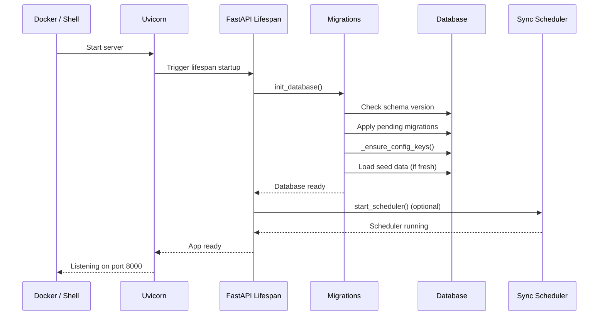
